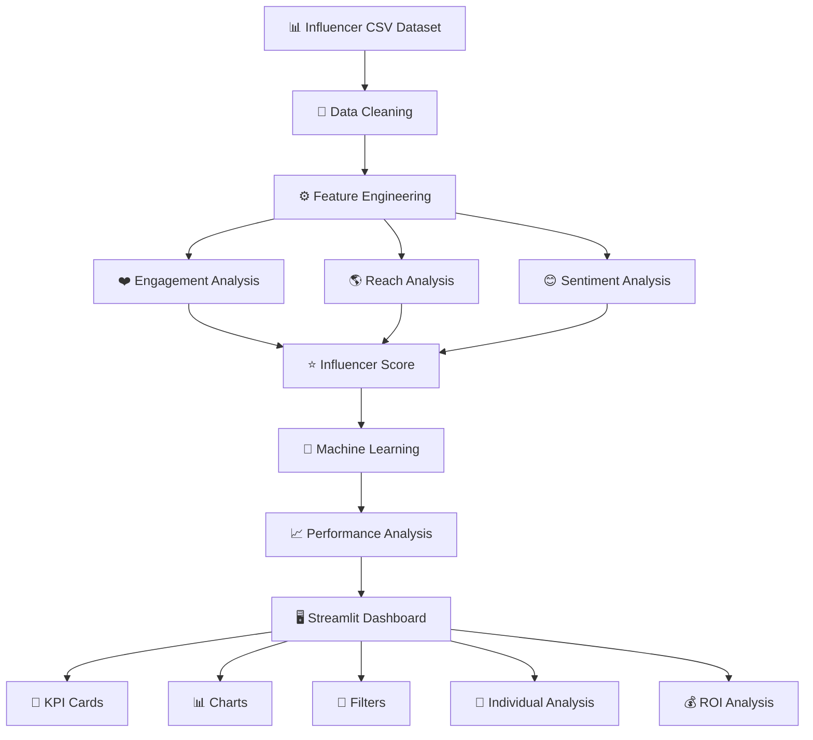
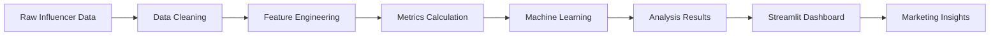

# 🤖 AI Influencer Analysis

<p align="center">

### 📊 Social Media Influencer Performance & Marketing Intelligence

**Analyze • Compare • Score • Visualize**

An interactive **Python + Machine Learning + Streamlit** application designed to analyze social media influencer performance and transform raw influencer data into meaningful marketing insights.

<br>

[🚀 Live Demo](PASTE_YOUR_STREAMLIT_LINK_HERE) • [💻 GitHub Repository](https://github.com/SAILIKHITH243/ai-influencer-analysis)

</p>

---

## 🌟 Project Overview

Influencer marketing is an important part of modern digital marketing. However, choosing the right influencer is not as simple as looking at follower count.

An influencer with millions of followers may have low engagement, while an influencer with a smaller audience may generate much stronger interaction.

**AI Influencer Analysis** solves this problem by analyzing multiple influencer performance metrics and presenting the results through an interactive dashboard.

### 🔍 The system analyzes:

* 👥 Followers & Following
* ❤️ Likes
* 💬 Comments
* 🔄 Shares
* 📈 Engagement Rate
* 🌎 Audience Reach
* ⭐ Influencer Performance Score
* 💰 Campaign ROI
* 📱 Platform Performance
* 🤖 Machine Learning Analysis

---

# 🎯 Problem Statement

Brands and marketing teams often face several challenges when selecting influencers:

| Problem               | Challenge                                                 |
| --------------------- | --------------------------------------------------------- |
| 👥 Follower Count     | High followers do not always mean high influence          |
| ❤️ Engagement         | Difficult to compare engagement between influencers       |
| 🌎 Reach              | Audience reach varies across influencers                  |
| 💰 Campaign Cost      | Expensive campaigns may not always provide better results |
| 📊 Data Volume        | Manual analysis becomes difficult with many influencers   |
| 📱 Multiple Platforms | Performance differs across social platforms               |
| 🔎 Decision Making    | Marketing teams need centralized performance insights     |

### The core problem

> **How can we analyze influencer data and identify meaningful performance patterns using data analytics and machine learning?**

---

# 💡 Proposed Solution

The proposed solution is an interactive influencer analytics platform that combines **data processing, feature engineering, machine learning, and visualization**.

Instead of evaluating influencers using only follower count, the system considers multiple measurable factors.

### 🔄 Solution Workflow

```text
                    ┌───────────────────────┐
                    │   Influencer Dataset  │
                    │      influencer.csv   │
                    └───────────┬───────────┘
                                │
                                ▼
                    ┌───────────────────────┐
                    │     Data Cleaning     │
                    │    Pandas + NumPy     │
                    └───────────┬───────────┘
                                │
                                ▼
                    ┌───────────────────────┐
                    │  Feature Engineering  │
                    └───────────┬───────────┘
                                │
               ┌────────────────┼────────────────┐
               ▼                ▼                ▼
        ┌─────────────┐  ┌─────────────┐  ┌─────────────┐
        │ Engagement  │  │    Reach    │  │  Sentiment  │
        │   Analysis  │  │   Analysis  │  │   Analysis  │
        └──────┬──────┘  └──────┬──────┘  └──────┬──────┘
               │                │                │
               └────────────────┼────────────────┘
                                ▼
                    ┌───────────────────────┐
                    │  Influencer Scoring   │
                    └───────────┬───────────┘
                                │
                                ▼
                    ┌───────────────────────┐
                    │ Machine Learning      │
                    │      Model            │
                    └───────────┬───────────┘
                                │
                                ▼
                    ┌───────────────────────┐
                    │ Performance Analysis  │
                    └───────────┬───────────┘
                                │
                                ▼
                    ┌───────────────────────┐
                    │ Streamlit Dashboard   │
                    └───────────────────────┘
```

---

# 🧠 How It Works

### 1️⃣ Data Collection

Influencer information is stored in a structured CSV dataset.

Example data:

```text
Name | Platform | Followers | Likes | Comments | Shares | Reach
```

### 2️⃣ Data Cleaning

Python and Pandas are used to:

* Load the dataset
* Clean column names
* Handle missing values
* Convert numerical fields
* Prepare data for analysis

### 3️⃣ Feature Engineering

Additional performance metrics are calculated from the available data.

Examples:

```text
Total Engagement
Engagement Rate
Reach Rate
Engagement Score
Reach Score
Influencer Score
```

### 4️⃣ Performance Analysis

The system compares influencers based on engagement, reach, audience size and other available metrics.

### 5️⃣ Machine Learning

Scikit-learn is used for machine-learning analysis and the trained model is stored as:

```text
influencer_model.pkl
```

### 6️⃣ Interactive Dashboard

Streamlit converts the analysis into an easy-to-use dashboard containing KPIs, charts, filters and individual influencer analysis.

---

# 🏗️ System Architecture



---

# 🔄 Data Flow



---

# 📐 Key Metrics

## ❤️ Engagement Rate

Engagement rate measures audience interaction relative to the influencer's follower count.

```text
Engagement Rate =
(Likes + Comments + Shares) / Followers × 100
```

---

## 🌎 Reach Rate

Reach rate measures audience reach relative to the follower base.

```text
Reach Rate =
Reach / Followers × 100
```

---

## ⭐ Influencer Performance Score

The system combines multiple performance factors to create an overall influencer score.

```text
                 Engagement
                      +
                     Reach
                      +
                  Sentiment
                      ↓
             Influencer Score
```

This provides a broader performance view than follower count alone.

---

## 💰 Campaign ROI

When campaign cost and revenue information are available:

```text
ROI =
(Revenue - Campaign Cost)
------------------------- × 100
     Campaign Cost
```

---

# 🤖 Machine Learning

### Model

**Random Forest**

The project uses **Scikit-learn** for machine-learning analysis.

The trained model is stored in:

```text
influencer_model.pkl
```

### Why Random Forest?

Random Forest can work with multiple numerical features and is useful for analyzing relationships between influencer performance metrics.

The current model is intended as a project-level analytical component and can be improved further with larger and real-world datasets.

---

# 🖥️ Dashboard

The Streamlit dashboard provides an interactive interface for exploring influencer performance.

### 📌 Dashboard KPIs

```text
┌──────────────────┐  ┌──────────────────┐
│ Total Influencers│  │ Avg Engagement   │
└──────────────────┘  └──────────────────┘

┌──────────────────┐  ┌──────────────────┐
│ Avg Followers    │  │ Avg Score        │
└──────────────────┘  └──────────────────┘
```

### 📊 Dashboard Analysis

* Influencer Performance
* Engagement Rate
* Audience Reach
* Campaign ROI
* Individual Influencer Analysis

### 🔎 Interactive Filters

* Platform selection
* Influencer search
* Individual performance analysis

---

# 📸 Dashboard Preview


### 📊 Main Dashboard


### 📋 Influencer Performance


### 🏆 Influencer Performance Score


### 📈 Engagement Rate Analysis


### 👥 Follower Analysis


---

# 📂 Project Structure

```text
ai-influencer-analysis/
│
├── 📄 app.py
│   ├── Streamlit application
│   ├── Dashboard UI
│   ├── Filters
│   ├── KPIs
│   └── Visualizations
│
├── 📄 influencer.py
│   ├── Data processing
│   ├── Feature engineering
│   ├── Metrics calculation
│   └── Machine learning logic
│
├── 📊 influencer.csv
│   └── Raw influencer dataset
│
├── 📊 influencer_analysis_results.csv
│   └── Processed analysis results
│
├── 🤖 influencer_model.pkl
│   └── Trained machine learning model
│
├── 📋 requirements.txt
│   └── Python dependencies
│
└── 📖 README.md
    └── Project documentation
```

---

# 🛠️ Technology Stack

| Technology      | Purpose                     |
| --------------- | --------------------------- |
| 🐍 Python       | Core programming            |
| 🐼 Pandas       | Data analysis               |
| 🔢 NumPy        | Numerical calculations      |
| 🤖 Scikit-learn | Machine learning            |
| 📊 Streamlit    | Interactive dashboard       |
| 📁 CSV          | Dataset storage             |
| 🔧 Git          | Version control             |
| 🌐 GitHub       | Source code & collaboration |

---

# ⚙️ Run the Project Locally

## 1. Clone the Repository

```bash
git clone https://github.com/SAILIKHITH243/ai-influencer-analysis.git
```

## 2. Open the Project

```bash
cd ai-influencer-analysis
```

## 3. Install Dependencies

```bash
pip install -r requirements.txt
```

## 4. Run Streamlit

```bash
streamlit run app.py
```

The dashboard will open in your browser.

---

# 💼 Real-World Use Case

Imagine a brand wants to select an influencer for a product campaign.

Instead of asking:

> "Who has the most followers?"

the company can analyze:

```text
        👥 Followers
             +
        ❤️ Engagement
             +
        💬 Comments
             +
        🔄 Shares
             +
        🌎 Reach
             +
        😊 Sentiment
             +
        💰 Campaign Cost
             │
             ▼
      📊 Influencer Analysis
             │
             ▼
      ⭐ Performance Score
             │
             ▼
      📈 Marketing Insights
```

This creates a more data-driven approach to influencer analysis.

---

# 🎯 Business Applications

This project can be useful for:

* 📢 Digital Marketing Agencies
* 🏢 Brands
* 🛍️ E-commerce Companies
* 📱 Social Media Teams
* 📊 Marketing Analysts
* 🤝 Influencer Management Agencies

---

# 🚀 Future Enhancements

The project can be extended with:

* 📱 Instagram API integration
* ▶️ YouTube API integration
* ⚡ Real-time influencer data
* 😊 Advanced sentiment analysis
* 🤖 Automated influencer recommendations
* 🔍 Influencer comparison
* 📈 Campaign performance prediction
* ☁️ Cloud database integration
* 📊 Advanced analytics
* 📑 Automated marketing reports

---

# ⚠️ Limitations

* The current project uses a sample dataset.
* Social media data is not collected in real time.
* ROI analysis depends on the availability of campaign data.
* Machine-learning performance depends on dataset quality and size.
* Real-world influencer analysis would require live social-media APIs.

---

# 📚 Learning Outcomes

This project provided practical experience with:

* Python
* Data Cleaning
* Data Analysis
* Pandas
* NumPy
* Feature Engineering
* Machine Learning
* Scikit-learn
* Streamlit
* Data Visualization
* Git
* GitHub
* Application Deployment

---

# 🌐 Project Links

### 🚀 Live Application

**[Open AI Influencer Analysis Dashboard]
https://ai-influencer-analysis-5st3u3j6ammqrytvqvzwpu.streamlit.app/

### 💻 Source Code

**[View GitHub Repository](https://github.com/SAILIKHITH243/ai-influencer-analysis)**

---

# 👨‍💻 Author

## Sai Likhith

**B.Tech — Computer Science & Engineering (IoT)**

GitHub:
https://github.com/SAILIKHITH243

---

# ⭐ Support

If you find this project useful, consider giving it a ⭐ on GitHub.

---

<p align="center">

### 🤖 AI Influencer Analysis

**Turning Influencer Data into Marketing Insights.**

Built with ❤️ using Python, Machine Learning & Streamlit.

</p>
